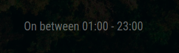

# MMM-Hue-Motion-Screensaver

The MMM-Hue-Motion-Screensaver module allows you to automatically control the screen of your [MagicMirror²][mm] based on motion detected by a Philips Hue motion sensor.

With this module, you can ensure that your [MagicMirror²][mm] is only active when someone is nearby, providing a seamless and intelligent user experience, as well as saving energy and extending the life of your screen. It is easy to integrate into your existing MagicMirror² setup.

## Examples

| Screenshot | Description |
|------------|-------------|
|  | *Display when the timer is active and the screen is about to turn off.* |
|  | *Display when motion is detected.* |
|  | *Display when `activeDays`, `startTime`, and `endTime` are configured, and the screen stays on between the specified times on those days.* |
|  | *Display right after MagicMirror starts, when no motion has been detected yet.* |

## Installation

### Install

In your terminal, go to your [MagicMirror²][mm] Module folder and clone MMM-Hue-Motion-Screensaver:

```bash
cd ~/MagicMirror/modules
git clone https://github.com/Zaro-kar/MMM-Hue-Motion-Screensaver.git
```

### Update

```bash
cd ~/MagicMirror/modules/MMM-Hue-Motion-Screensaver
git pull
```

## Using the module

To use this module, add it to the modules array in the `config/config.js` file:

```js
{
    module: 'MMM-Hue-Motion-Screensaver',
    position: 'lower_third',
    config: {
        hueBridgeID: 'your-hue-bridge-id', // Required
        sensorId: 'your-sensor-id', // Required
        apiKey: 'your-api-key', // Required
    }
}
```

## Configuration options

Option|Possible values|Default|Description
------|------|------|-----------
`hueBridgeID`|`string`|not available|**Required**. The ID of your Hue Bridge (e.g., "beb7cfcccd56ab3a")
`sensorId`|`string`|not available|**Required**. The ID of the motion sensor (e.g., "1")
`apiKey`|`string`|not available|**Required**. The API key for the Hue Bridge (e.g., "your-api-key")
`coolDown`|`number`|300|The cooldown time in seconds before the screen turns off (e.g., 300)
`activeDays`|`array`|["Sat", "Sun"]|The days on which the module is always on (e.g., ["Mon", "Tue", "Wed", "Thu", "Fri", "Sat", "Sun"]). **Note:** The `startTime` and `endTime` settings are only effective on these days.
`startTime`|`string`|"06:00"|The start time in "HH:MM" format (e.g., "06:00"). **Note:** This works only in conjunction with `activeDays`. The monitor will stay on between `startTime` and `endTime` only on the days defined in `activeDays`.
`endTime`|`string`|"22:00"|The end time in "HH:MM" format (e.g., "22:00"). **Note:** This works only in conjunction with `activeDays`. The monitor will stay on between `startTime` and `endTime` only on the days defined in `activeDays`.
`pollInterval`|`number`|2000|The polling interval in milliseconds (e.g., 2000)
`language`|`string`|"en"|The language for the display (available options: "en", "de")

## Obtain the Values for the required parameter

[Official 'Getting Started' guid from Philips Hue](https://developers.meethue.com/develop/hue-api-v2/getting-started/)

### Obtaining the Hue Bridge ID

To find the ID of your Hue Bridge, you can use the following command:

```bash
openssl s_client -showcerts -connect <Bridge-IP-Address>:443
```

The output will include a line like this:

```
# I've replaced the actual ID with 'HUE_BRIDGE_ID'
subject=/C=NL/O=Philips Hue/CN=<HUE_BRIDGE_ID>
issuer=/C=NL/O=Philips Hue/CN=<HUE_BRIDGE_ID>
```

### Add the Bridge ID as host to /etc/hosts

In order to use https for the requests to the Hue Bridge, you have to add the `hueBridgeID` along with the IP address of the Hue Bridge to the `/etc/hosts` file:

```bash
sudo nano /etc/hosts
```

Add the following line:

```
<Bridge-IP-Address>     <hueBridgeID>
```

### Generating an API key

To generate an API key for your Hue Bridge, follow these steps:
1. Press the link button on your Hue Bridge.
2. Within 30 seconds, send a POST request to the Hue Bridge using a tool like `curl`:
   ```bash
   curl -X POST -d '{"devicetype":"my_hue_app"}' http://<hue-bridge-ip>/api
   ```
3. The response will contain a username, which is your API key.

### Finding the sensor ID

To find the ID of your Hue motion sensor, you can use the Hue API. Open a web browser and go to `https://<bridge-ip-address>/clip/v2/resource/device`. Make sure you are on the same network as the bridge and use the IP address obtained earlier. Look for the sensor with the type "ZLLPresence" and note its ID.

### Hue Bridge CA Certificate

The `hue_bridge_ca_cert.pem` file included in this project is the public CA certificate for the Hue Bridge. It is used to establish a secure HTTPS connection with the Hue Bridge. You can find this certificate on the official Philips Hue developer website: [Using HTTPS](https://developers.meethue.com/develop/application-design-guidance/using-https/).

## Sending notifications to the module

Notification|Description
------|-----------
`CHECK_MOTION`|Checks the motion status of the sensor
`TOGGLE_SCREEN`|Toggles the screen on or off

## Developer commands

- `npm install` - Install devDependencies like ESLint.
- `npm run lint` - Run linting and formatter checks.
- `npm run lint:fix` - Fix linting and formatter issues.

[mm]: https://github.com/MagicMirrorOrg/MagicMirror