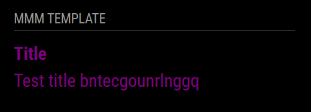

# MMM-Hue-Motion-Screensaver



This MagicMirror module controls the screen based on motion detected by a Philips Hue motion sensor.

## Installation

### Install

In your terminal, navigate to your [MagicMirror²][mm] `modules` folder and clone the repository:

```bash
cd ~/MagicMirror/modules
git clone https://github.com/Zaro-kar/MMM-Hue-Motion-Screensaver
```

### Update

To update the module, navigate to the module's directory and pull the latest changes:

```bash
cd ~/MagicMirror/modules/MMM-Hue-Motion-Screensaver
git pull
```

## Using the module

To use this module, add it to the `modules` array in your `config/config.js` file:

```javascript
{
    module: "MMM-Hue-Motion-Screensaver",
    position: "fullscreen_above", // Adjust position if needed
    config: {
        hueHost: "<HUE_BRIDGE_IP_OR_HOSTNAME>", // IP or hostname of the Hue Bridge
        sensorId: "<MOTION_SENSOR_ID>", // Sensor ID of the motion detector
        apiKey: "<HUE_API_KEY>", // Hue API key
        coolDown: 300, // Cooldown time in seconds
        startTime: "06:00", // Time range start when screen stays on
        endTime: "00:00", // Time range end when screen stays on
        pollInterval: 2000 // Poll interval for motion detection in milliseconds
    }
}
```

## Configuration options

Option|Possible values|Default|Description
------|------|------|-----------
`hueHost`|`string`|`not available`|IP or hostname of the Hue Bridge
`sensorId`|`string`|`not available`|ID of the motion sensor
`apiKey`|`string`|`not available`|Hue API key for accessing the Bridge
`coolDown`|`integer`|300|Cooldown time (in seconds) before turning off the screen
`startTime`|`string`|`06:00`|Start time for the active time range
`endTime`|`string`|`00:00`|End time for the active time range
`pollInterval`|`integer`|2000|Interval in milliseconds to poll the motion sensor

## Sending notifications to the module

Notification|Description
------|-----------
`MOTION_DETECTED`|Triggered when motion is detected
`NO_MOTION`|Triggered when no motion is detected after cooldown

## Developer commands

- `npm install` - Install dependencies.
- `npm run lint` - Run linting checks.
- `npm run lint:fix` - Fix linting issues.

[mm]: https://github.com/MagicMirrorOrg/MagicMirror
